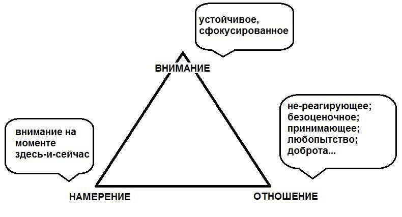

# Стул с тремя ножками

## Внимание

* Устойчивое
* Сфокусированное

## Намерение

* Внимание на моменте **Здесь-и-Сейчас**

## Отношение

* Безоценочность
* Нецепляние
* Терпение
* Нестремление
* Любопыство ума
* Доверие
* Принятие
* Как поступила бы Любовь
* Доброта и Ненасилие

### 1. Безоценочность

**Безоценочность** — осознавать то, что вы переживаете, таким, какое оно есть, без осуждения умом на хорошее и плохое, приятное или неприятное, нравиться или ненравиться, хочу или не хочу. Ум очень любит выносить суждения и наклеивать ярлыки на реальность.

> _Как только замечаем в сознании процесс суждения опыта, включаем второй принцип._

### 2. Нецепляние

**Нецепляние** за приятную или негативную оценку.

> _В Индии ловят обезьян подобным способам. Делают в ловушке дыру, в которую влазит рука сжатая в кула, но не вылазит с бананом обратно. Достаточно только отпустить банан (ситуацию, переживание, оценку ума, эмоцию) и обезьяна будет свободной, но, как правило, большинство обезьян, да и людей на это не способны. Могут держать бананы днями и годами в уме._
> _Вот так мы зацикливаемся на какой-то проблеме, не можем отпустить уже ушедший момент и теряем контакт с здесь и сейчас. В таких ситуациях скажите себе "Просто отпусти", расслабтесь и отдайтесь течению настоящего момента. Это тоже привычка ума, которая ворует наше внимание от здесь и сейчас._

### 3. Терпение

**Терпение**, без которого невозможно развитие.

> _Постоянный возврат на настоящее и развитие принципов этих в уме дадут свои плоды в этом._
> _Не торопитесь: спешить некуда, дайте себе время. Устройтесь на подушке, сидите, как если бы вы собрались медитировать целый день. Для развития всего, что действительно представляет ценность, требуется время. Терпение, терпение и еще раз терпение!_
> _Если дергать бабочку из кокона раньше времени она умрёт. Так же и прогресс в йоге и гонка за формами._
> _Ум не любит терпеть. Поэтому любит отвлекаться и уходить в грезы, гнаться за формами и бросать практику._
> _Если результат вам не заметен, то это не значит, что его нет! Все ценное, как бриллианты под землей, рождаются постепенно, микро дозами. 1,01 в 365 степени дает 37,8._
> _Нет никаких олимпов и пьедесталов в йоге. Вы просто делаете все возможное и наслаждаетесь этим._

### 4. Нестремление

**Нестремление** — отстуствие целеполагания в самой практике.

> _Отпустите мысли "Мне надо глубже тянуться", "Щас вот скоро сяду уже в лотос", "Проверю на что способен", "Щас страдаю, но потом будет круто". Фокус внимания от настоящего момента быстро ушел в какой-то образ в будущем. И связь потеряна, а без связи с здесь и сейчас уже боль и травма появляется, ибо витаем в облаках не отслеживая движания все. Где-то перетенули, где-то зажали, где-то не устояли и упалию_

> _По терпению помогает настройка что я буду делать асаны 10 часов и для этого нужно размазать энергию. Всё становиться плавным, лёгким, приятным, энергоэкономным, без отдышки и пульса выше 60-70, а ум уже не стремиться закончить скорее всё.

### 5. Любопыство ума

**Любопыство ума** — относитесь к каждой практике как к новому приключению неизведанному, будто делаете все впервые.

> _Улавливайте новые тонкие моменты, глубже погружайтесь в асаны, наслаждайтесь движениями как Пикассо движениями кисти. Ибо каждый момент жизни уникален и неповторим!_
> _На уровне каждой асаны, даже 1000 раз знакомой вам, всегда следует стараться сохранять свежесть осознания, каждого вдоха, каждого движения, памятуя о его уникальности, ибо скука в практике и в жизни, это симптом того, что нас развёл ум в свои грезы обесценив здесь и сейчас. Смотрите свежим взглядом на партнера, друга, домашнее животное, небо, место, знакомую картину, как если бы вы видели их в первый раз и искореняйте из сознания привычку принимать обычное за само собой разумеющееся в жизни._
> _Сделайте коврик храмом, в пределах которого запрещено думать о мирском, как в настоящих храмах. Вступили на него и всё, мир исчезает. Есть только вы и практика. Дайте обет такой себе. Заметили что нарушаете, без осуждения себя верните внимание просто._

### 6. Доверие

**Доверие** своему собственному свету сознания и текущему потенциалу.

> _Мы здесь не чтобы стать Каруной, чтобы стать собой в ещё большей степени благодаря его практикам и заботой о нас. Учителя, практики, курсы и эти советы всего лишь ориентиры для вашей внутренней мудрости!_
> _Нужно быть открытыми и восприимчивыми к новым знаниям, но в конечном итоге вы должны жить своей жизнью, смотреть на неё своими глазами и наслаждаться каждым её моментом, а не подражать другим людям, что всегда будет ложной дорогой. Каждый уникален, каждый неповторим и у каждого своя, не похожая на другого, дорога жизни._
> _С помощью йоги вы учитесь брать на себя ответственность за свою жизнь и за то, чтобы быть собой, прислушиваться и доверять самому себе._

### 7. Принятие

**Принятие** текущей реальность такой, какая она есть, а не возмущаться из-за несовпадения ожиданий ума с истиной **Здесь-и-Сейчас**.

### 8. Как поступила бы Любовь

Любящая доброта ко всему что вы делаете и ко всем, с кем вы разговариваете и что-то делаете.

### 9. Доброта и Ненасилие

## Коаны

* Итого у нас получается устойчивая конструкция для проживания **Здесь-и-Сейчас**.

* Без умелого отношения, как на двух ножках, долго не усидеть.

* Так и есть, зрелый ум это воспитанный ум, как здоровое тело очищенное.

* Незрелый ум, как маленький ребёнок, который дергает подол вечно платья маме внимания. Отвлекая маму от дел своих в настоящем моменте.

* Оценка каких-то феноменов и ощущений как что-то опасное, на это клеится ярлык "Надо паниковать" и пошло поехало. Замечаем это, не отвлекаемся на эти мысли и осознаем дыхание просто.

* Принципы развивать всю жизнь эти, как удобно, но лучше постепенно.

* 95% проблем в жизни, это нейтральные ситуации которым ум дал оценку как проблема и понеслась: увидел веревку на дереве, ясно не посмотрели, подумали змея, побежали, поцарапали ветками лицо, упали, разбили колено, сидим плачем.

* Даже смерть для йогов познавших себя это не проблема, а не более чем переходный этап неизбежный. Каждый день все умирают на кровати и не бояться этого.

* Если вдруг в самолете объявят крушение, то сидите спокойно и практикуйте осознанное дыхание 😌 Как впрочем и в других подобных ситуациях, где от вас ничего уже не зависит, кроме как оставаться присутствием.

* Практика, практика и еще раз практика йоги, Ямы Ниямы и принципов осознанности в настоящем моменте.

* Капля практики равно ведру теории.

* Это поэтому называется отношением к опыту любому в настоящем.

* Походите некоторое время просто осознавая реальность но не описывая ее никак. Солнце же не назовет себя Я – солнце. Собака не знает что она собака. Жаркая погода не знает что она погода и что она еще для кого-то плохая. Огонь не знает что он опасный для тех, чей дом сгорел.

* Все оценки и описания реальности от ума людей в этом мире.

* Поживите так хотя бы пару часов каждый день, осознавая все как безымянные пейзажи не описывая их никак.

* Кто-то грубит и орет в пробке, то это просто кино фоновое такое какое есть, а не "Блин, хватить орать плохой человек, мешаешь мне быть в состоянии гармонии и ясности!!!"

* Не так часто падают кирпичи и самолеты, как об этом думают люди.

* Как часто человек что-то сказал нам без намерения обидеть, навредить, приченить боль, а сделал это неосознанно, страдает чем-то сам, а мы на автопилоте наклеиваемя ярлык "Он оскорбил меня", "Он приченяет мне боль", "Ах щас я тебе тут покажу", "Всё, закрываюсь от общения с тобой!"

* Ум и тело не враги, а любимые друзья и помощники сознания, как непослушные дети у мамы, которые не вовлечены в **Здесь-и-Сейчас** тотально.

* Единство тела и ума и сознания растворяют тело ум и внимание в то, что вы делаете **Здесь-и-Сейчас**. Неважно что, идете, лежите, кушаете, работаете, творите или планируете день или жизнь. Во все вовлекайте Единство Трёх. И тогда не будет Лебедя Рака и Щуки.

* Если думаете о будущем часто, то уделите 1-2 часа дня планированию дня и недели, запишите задачи все, а потом смысл думать уже во время йоги о том, чтобы сделать завтра, если это прописано вами в отдельном осознанном деле?

* Вечером запланируйте завтрашний день по пунктам, а с утра не отвлекаясь на мысли каждую строчки проживайте тотально не отвлекаясь.
